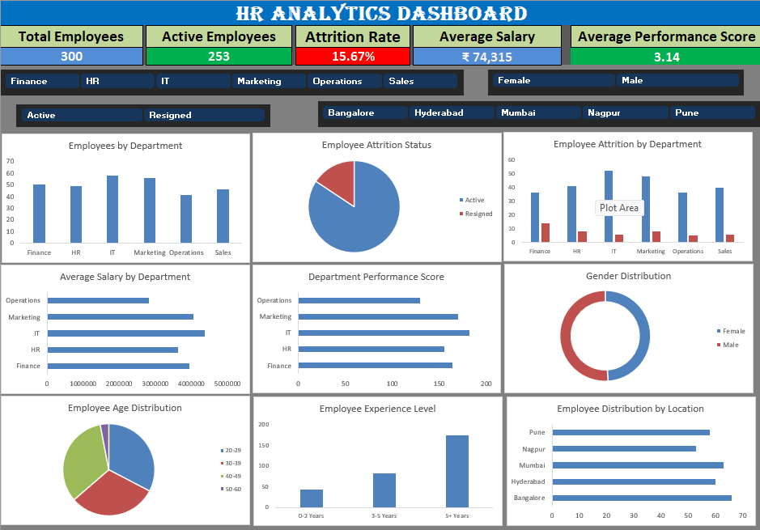

# HR_Analytics_Dashboard

## Project Overview
This project features an itercative HR Analytics Dashboard built in Microsoft Excel. It is designed to track organizational health, monitor workflow demographics, and provide data-driven insights into employee attrition and performance.

By aggregating complex HR records into a single, intuitive interface, this dashboard enables HR leardership and business partners to make proactive decision regarding retention strategies and talent management.

 ---
 
 ## Dashboard Preview
 Below is visual overview of the interactive dashboard interface as seen in the workbook:

 

 ---

 ## Deep-Dive & Business Insights

 ## 1. THe Core Problem
 High employee turnover is costly and disrupts productivity. The objective of this project was to analyze historical HR data to pinpoint excatly which department, demogtraphic group, or regions are experiencing the highest atrrition, and to understand if salary or performance scores correlate with employee exits.

 ## 2. Key Data Insights
 Based on the dashboard analysis shown in 'HR_Analytics_Dashboard.png':
 * **Retention Overview:** The organization maintain an overall headcount of **300 employees**, with **253 active** staff members.
 * **Attrition Baseline:** The company's overall attrition rate stands at **15.67%** (47 resigned employees). THis serves as a vital bechmark for Hr to monitor quarter-over-quarter.
 * **Departmental Risk Areas:** The *Employee Attrition by Department* bar chart highlights that the **IT and Sales** departments experience a significantly higher volume of exits compared to finance or HR, signaling a potential need for cultural or leadership reviews in those teams.
 * **Experience & Retention:** The *Employee Experience level* charts shows a major retention spike among senior staff with **5+ years of experience**, while mid-level retention (3-5 years) shows the steepest drop, indicating that career progression paths may need to be restructured.
 * **Performance Benchmark:** The average performance score across the workforce sits at **3.14 out of 5.0**, giving leadership a reliable baseline for merit-based evaluations.

---

## Technical Implementation & Architecture 
The project structure relies on a multi-sheet data architecture ('HR_Data', 'Dashboard', and 'Pivot' sheets) to ensure clean separation between raw data and the presentation layer:

1. **Data Cleaning & Preprocessing ('HR_Data'):** Cleaned raw HR records to handle missing values, standardize structural fields (such as location cities like Bangalore, Hyderabad, Mumbai, Nagpur, and Pune), and format currency fields.
2. **Data Modeling('Pivot'):** Developed  underlying pivot Tables to dynamically aggregate employee headcounts, calculate mathematical attrition rates, and average out performance scores.
3. **UI/UX & Dashboard Design('Dashboard'):**
   *Designed high-level KPI cards at the top for immediate executive visibility.
   *Leveraged a cohesive color scheme to distinguish between active and resigned employees.
   *Integrated **Interactive Slicers** (Department, Gender, Status, and City Location) to allow stakeholders to dynamically filter the entire visual interface with a single click.

---

## Repository Structure
*'HR_Analytics_Dashboard.xlsx': The main interactive Excel Workbook containing the raw data, pivot tables, and the visual dashboard.
*'HR_Analytics_Dashboard.png': Dashboard preview image used for documentation.

---

## How To Explore the Dashboard
1.**Download** the 'HR_Analytics_Dashboard.xlsx' file from Repository.
2.**Open** the file using Micosoft Excel(desktop version recommended for full slicer functionality).
3.**Interact**with the dashboard ny clicking the slicer buttons at the top(e.g.,fliter by *finance* or *Mumbai*) to watch the charts automatically update in real-time.
